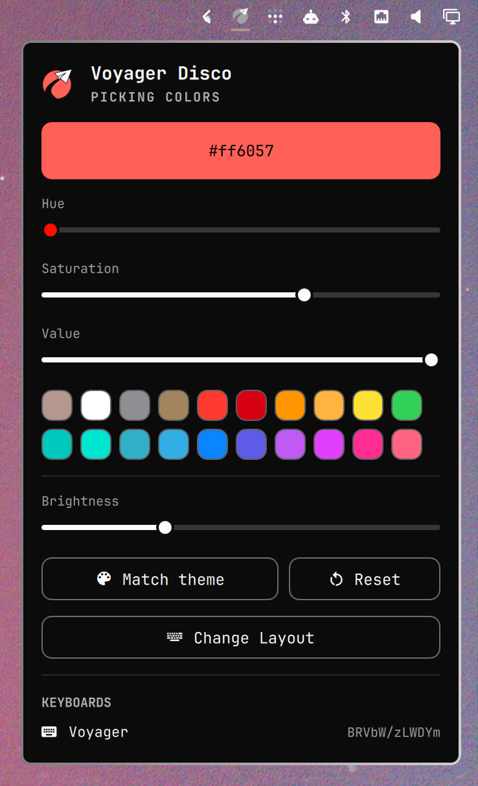

# Omarchy Voyager Disco

Change the color of your ZSA keyboard from Omarchy's bar!



## Demo

https://github.com/user-attachments/assets/8a480bcd-bb1f-426d-b203-ebd345176fcb

https://github.com/user-attachments/assets/3086eb4b-86ee-45a4-be59-7a1ae2f85087


## Requirements

- Omarchy 4 with `omarchy-shell` (bar widgets / Quickshell)
- [`voyager-disco`](https://github.com/monorkin/voyager-disco) on your `PATH` (`yay -S voyager-disco` on Arch)

## Installation

```sh
omarchy plugin add https://github.com/monorkin/omarchy-voyager-disco.git --enable
```

Without `--enable` the plugin lands disabled so you can review the code first; turn it on with `omarchy plugin enable monorkin.voyager-disco` or from **Setup › Plugins**. Enabling places the widget in the bar's right section — move it with:

```sh
omarchy bar move monorkin.voyager-disco --section right --index 0
```

## Removal

```sh
omarchy plugin remove monorkin.voyager-disco
```

The widget keeps its state in `~/.local/state/voyager-disco/widget.json`; delete that file if you want a fully clean removal. The `voyager-disco` CLI is a separate package and stays installed until you remove it yourself (`yay -R voyager-disco` on Arch).

## Settings

| Key      | Type   | Default | Description                                            |
|----------|--------|---------|--------------------------------------------------------|
| `device` | string | `""`    | Comma-separated keyboard serials to target (empty = all) |

```sh
omarchy bar set monorkin.voyager-disco device ABC123
```

## IPC

The widget registers a `monorkin.voyager-disco` IPC target:

```sh
omarchy-shell monorkin.voyager-disco toggle
omarchy-shell monorkin.voyager-disco setColor ff00aa
omarchy-shell monorkin.voyager-disco matchTheme
omarchy-shell monorkin.voyager-disco reset
```

## License

MIT - see [LICENSE](LICENSE) for details.
